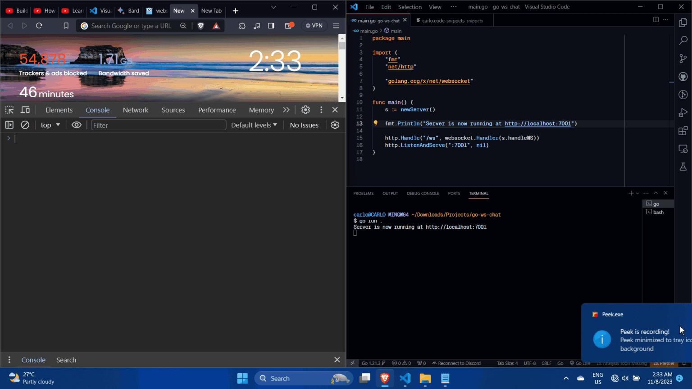

# go-ws-chat

A golang server that uses websockets to send messages. Understood how to use the net/http, sending and receiving buffers via websockets, making methods in structs.

Based this on [Anthony GG's tutorial](https://www.youtube.com/watch?v=JuUAEYLkGbM)

